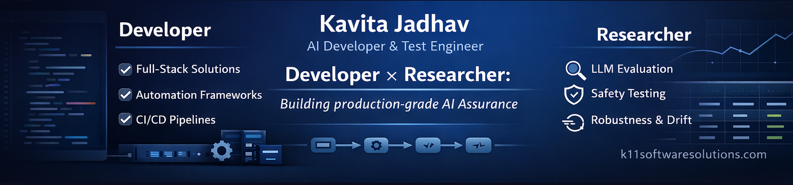

# Kavita Jadhav

**Trustworthy AI • LLM Testing • Full-Stack Automation**

I am an **AI Developer and Test Engineer (12+ years)** working at the intersection of **software engineering** and **AI assurance**. My research-oriented work focuses on converting probabilistic model behavior into **repeatable experiments** and **measurable evidence**—so AI-enabled systems remain **reliable under change** and **auditable in production**.

I design and build evaluation and automation systems that move beyond *“does it work?”* to answer: **is it safe, stable, and defensible under real-world conditions?**

---

## Start here (research + build artifacts)

### LLM Assurance & Evaluation
- **LLM Testing Hub**  
  🔗 https://github.com/K11-Software-Solutions/llm-testing-hub  
  *A research hub for LLM assurance—evaluation harnesses, regression suites, red-teaming scenarios, and reliability scorecards for repeatable, audit-ready testing.*

- **AI Assurance (Promptfoo)**  
  🔗 https://github.com/kavitaj11/weoptimize.ai_assurance_promptfoo  
  *Promptfoo-based AI assurance suite for LLM evaluation, regression testing, red-teaming scenarios, and audit-ready reporting.*

### Enterprise Test Automation Frameworks
- **K11 TechLab — Playwright + Python AI-Assisted Automation Framework**  
  🔗 https://github.com/K11-Software-Solutions/k11techlab-playwright-python-ai-assisted-framework  
  *Modern Playwright + PyTest automation framework with reusable fixtures, scalable structure, and AI-assisted testing patterns (prompt-driven test generation, resilient execution hooks, and extensibility for LLM/MCP-based workflows).*

- **K11 Tech Lab — Selenium + Java Full-Stack Framework (AI-assisted)**  
  🔗 https://github.com/K11-Software-Solutions/k11TechLab-selenium-java-fullstack-framework  
  *Enterprise automation framework emphasizing modular design, reporting, and repeatable execution—extended with AI-assisted testing and AI integration patterns (prompt-driven test generation, self-healing strategies, and evaluation hooks for AI/LLM-enabled workflows).*

- **K11 Tech Lab — Cucumber BDD + Java Full-Stack Framework**  
  🔗 https://github.com/K11-Software-Solutions/k11TechLab-cucumber-bdd-java-fullstack-framework  
  *BDD framework for scalable automation across UI + API + Mobile workflows, built for CI/CD and long-term maintainability.*

- **K11 Tech Lab — Vibium + Jest + AI-Augmented Test Framework** 
  🔗 https://github.com/K11-Software-Solutions/k11TechLab-vibium-jest-ai-test-framework
  *Production-style automation framework built with Vibium, Jest, and TypeScript, combining smoke, functional, API, DB, device, E2E, and Lighthouse testing with timestamped reporting, AI-assisted test generation, and AI agent + MCP browser automation workflows.*

### Full-Stack Engineering (portfolio)
- **Kavita Jadhav — AI Developer Portfolio (Gemini + Cloud Run)**  
  🔗 https://github.com/kavitaj11/kavita-jadhav-ai-developer-portfolio  
  *AI-powered portfolio showcasing full-stack engineering with a Gemini-backed chat experience, secure key handling via backend proxy, Dockerized deployment, and Google Cloud Run production hosting.*  
  *Walkthrough:* https://dev.to/kavitaj11/ai-powered-portfolio-full-stack-developer-showcase-with-google-gemini-cloud-run-2aaj

- **Full-Stack Developer Capstone**  
  🔗 https://github.com/kavitaj11/xrwvm-fullstack_developer_capstone  
  *End-to-end full-stack delivery demonstrating application development, API integration, and deployment-ready structure.*

- **Apollonia Dental Practice — Employee Management CRUD Web App**  
  🔗 https://github.com/kavitaj11/apollonia-dental-practice-employee-management-system-CRUD-web-app  
  *Full-stack CRUD application demonstrating end-to-end delivery.*

- **Greenspot Grocer — Relational Database Transformation Project**  
  🔗 https://github.com/kavitaj11/greenspot-grocery-portfolio-database-project  
  *Data modeling, normalization, and scalable database design from flat datasets.*

- **Rumi Press — Book Distribution Expense Tracker (Django)**  
  🔗 https://github.com/kavitaj11/django_based_rumi_press_book_distribution_expense_tracker  
  *Django-based expense tracking app for book distribution workflows, supporting structured record management, reporting-friendly data organization, and deployment-ready project setup.*

- **Euro Orbit Travel Agency — 7-Day Weather Forecast App**  
  🔗 https://github.com/kavitaj11/euro-orbit-travel-agency-7-day-weather-forecast-app  
  *Weather forecast application providing a 7-day view with API-driven data fetching, user-friendly UI, and deployment-ready structure.*

---

## Research interests

My current interests focus on **reliability, safety, and governance-aligned evaluation** for LLM-enabled systems:

- **LLM evaluation methodology & benchmarking**
  - Reproducible harness design, multi-model comparisons, metric selection, regression protocols  
- **Failure mode characterization**
  - Hallucination patterns, prompt sensitivity, bias/fairness gaps, context-window limits, behavioral drift  
- **Adversarial testing & red teaming**
  - Prompt injection, jailbreak resilience, adversarial formatting/obfuscation, privacy/PII leakage, unsafe content pathways  
- **Robustness & production monitoring**
  - Drift detection signals, stability under distribution shift, reliability scorecards, audit-friendly evidence trails  
- **Evaluation in CI/CD**
  - Automated quality gates, traceable results, compliance-aligned test suites, reproducible reporting  
- **AI integration in legacy test automation frameworks**
  - Adding AI-assisted capabilities to existing Selenium/BDD/API frameworks (test generation, self-healing, intelligent assertions, flaky-test reduction) while maintaining determinism, traceability, and maintainable architecture  
- **AI application development & end-to-end validation**
  - Building and testing AI-enabled applications (RAG, agents/tool use, MCP-based integrations), with emphasis on observability, data/privacy controls, and evaluation-driven development
  

---

## What I build

- **Evaluation harnesses** and test suites for accuracy, faithfulness, safety, and compliance  
- **Full-stack validation** across UI + API + DB integrated into CI/CD pipelines  
- **Reliability artifacts**: scorecards, benchmark runs, failure-mode matrices, audit-friendly reporting  
- Frameworks that prioritize **testability-by-design** and production realism

---

## Domains

Banking • Healthcare Insurance (ORMB & EDI workflows) • Financial Trading • SaaS Subscription Commerce (Offer-to-Cash) • iEN Infrastructure Service Assurance

---

## Connect

- 🌐 K11 Software Solutions: https://k11softwaresolutions.com  
- GitHub: https://github.com/kavitaj11  

---

### Topics
`llm-testing` `ai-assurance` `red-teaming` `prompt-injection` `jailbreaks` `evaluation` `test-automation` `full-stack` `ci-cd` `quality-engineering` `trustworthy-ai`
